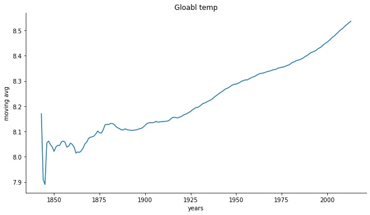
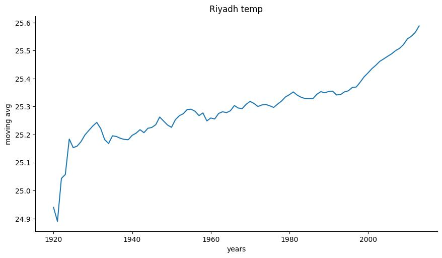
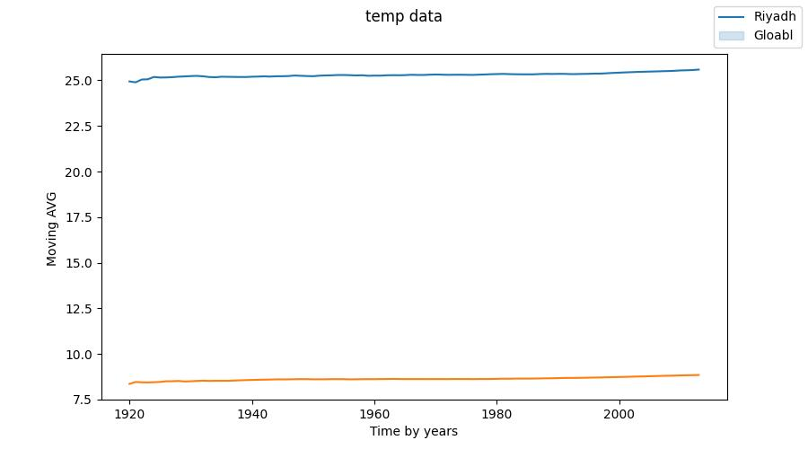

# that project is focusing on different and the similarity of tempreature locally and globally
 
this small project made by <b>Abdullah Alqahtani<b>
## An outline
<b> What tools did I use for each step? (Python, SQL, Excel, etc)</b>
 - extract the data (SQL) <br><br>
 for gloabl data <br>

 ```sql
SELECT * FROM global_data;
 ```
for local data <br>

 ```sql
SELECT * FROM city_data 
WHERE city='Riyadh';
 ```

 - clean data (Python - pandas)
 - visualization (python - seaborn)

<b>How did you calculate the moving average?</b>
I am using the following method
```python
 data['avg_temp'].expanding().mean()
```
<b>What were your key considerations when deciding how to visualize the trends?</b>

- I consedered X axis the time which is years and I consedered Y axis the moving AVG 

## Line chart 

<b> Global chart




<br>
 <br>

<b> Local chart</b>
<br>
 <br>


<b>subplot
<br>
 <br>



**Note** we use Moving AVG

<br>
 <br>
 
## questions
* Is your city hotter or cooler on average compared to the global average? Has the difference been consistent over time?

*  “How do the changes in your city’s temperatures over time compare to the changes in the global average?”

* What does the overall trend look like? Is the world getting hotter or cooler? Has the trend been consistent over the last few hundred years?

## answer 1

<b>Is your city hotter or cooler on average compared to the global average? Has the difference been consistent over time?</b>

First of all let's see the moving avg of gloabl data following by the next code 
```python 
p=sns.relplot(data=global_df,
x=(global_df['year']),y=(global_df['avg_temp'].expanding().mean()),kind='line',aspect=(16/9)
).set(title='Gloabl temp').set_ylabels('moving avg').set_xlabels('years')
```


     
     this is gloabl chart we can see there is a continuous rise and most of the time the temp between 8.0 and 8.4
**NOTE** we use Moving Avg     

 Than let's see the moving avg of Riyadh data following by the next code    
```python 
p=sns.relplot(data=global_df,
x=(riyad['year']),y=(riyad['avg_temp'].expanding().mean()),kind='line',aspect=(16/9)
).set(title='Riyadh temp').set_ylabels('moving avg').set_xlabels('years')
```

     
     this is Riyadh chart we can see there is a continuous rise and most of the time the temp between 24 and 25
**NOTE** we use Moving Avg

To show them in subplot we use <br>

```python
fig,plot =plt.subplots()
plot= sns.lineplot(x=riyad['year'], y=riyad['avg_temp'].expanding().mean())
plot2 = sns.lineplot(x=global_df['year'], y=global_df['avg_temp'].expanding().mean())
fig.legend(['Riyadh','Gloabl'])
fig.suptitle('temp data')
fig.set_figheight(5)
fig.set_figwidth(9)
plot.set_xlabel('Time by years')
plot.set_ylabel('Moving AVG ')
fig.savefig('subfig.jpg')
```


**NOTE** we use Moving Avg

<b>so the answer of</b> <u>Is your city hotter or cooler on average compared to the global average? Has the difference been consistent over time?</u>


- Riyadh is hotter than the world average

- There is no difference in consistency over time it all increases with time and gets hotter

## answer 2

 <b>“How do the changes in your city’s temperatures over time compare to the changes in the global average?” </b>

- in <b>Riyadh data</b>there is increases with time from 1850 to 2013

- Compared to the <b>Gloabl data</b>, we note the similarity that both of them increase over time, but the temperature of <b>Riyadh</b> increases more with the passage of time and this is the point of difference

## answer 3
<b>What does the overall trend look like? Is the world getting hotter or cooler? Has the trend been consistent over the last few hundred years?</b>

- It is clear to us from the data that the world is getting hotter with time

- We notice a huge increase in the global temperature in recent years, and I think that the reason for this is global warming


## This was a small project to answer some questions thank you for read my document
